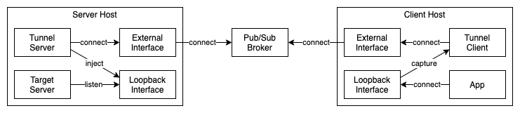

# PubSub Tunnel

A simple network tunneling mechanism for Pub/Sub transports

Tunnels traffic at layer 3 (IP) of the OSI model

### API

[See tests](test/index.spec.ts) for a basic use case that simply uses an EventEmitter as the Pub/Sub mechanism.

### Requirements

-   Installed `libpcap`
-   Special privileges
    -   Linux: `CAP_NET_RAW`
    -   MacOS: `/dev/bpf`

### Mechanism

This library uses `libpcap` internally to capture packets from the
loopback interface and send them through the provided Pub/Sub transport.

The tunneling mechanism has 2 roles: `server` and `client`.

0. Server subscribes to a `topic` and is ready for tunneling sessions
1. Client generates a session ID (128 bit) and start forwarding packets from a
   preconfigured address on the loopback interface to `topic` prepended
   by the session ID
2. Client subscribes to `topic/${base64(id)}` and performs NAT
   on received IP packets to first loopback address (127.0.0.1) before injecting it
3. Server upon receiving a new session ID allocates an IP in the loopback block
   (127.0.0.0/8) in a preconfigured range and performs NAT on the IP packet
   to the first loopback address (127.0.0.1) before injecting it in the interface
4. Server starts forwarding packets from the allocated address to `topic/${base64(id)}`

Note that IPs in the preconfigured range on the loopback block will be reused
in a LRU fasion, make sure the range is large enough such that new sessions will
not override existing ones.

### Network diagram

